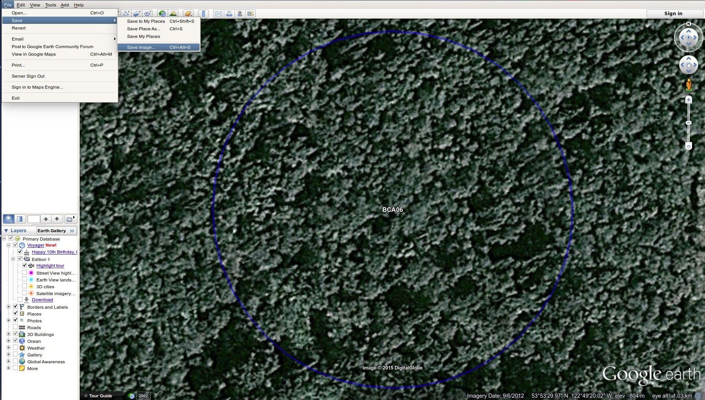
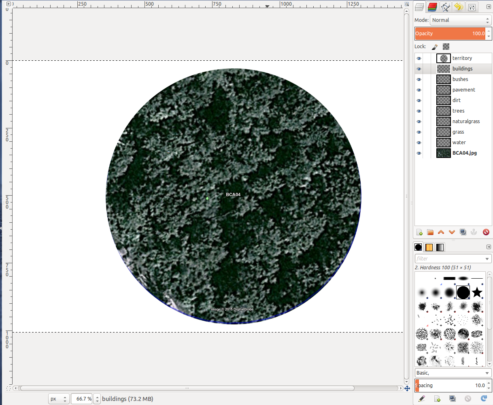
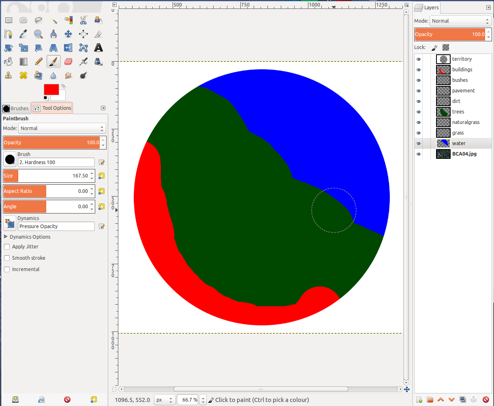
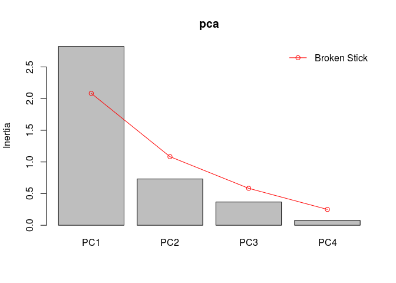

# Creating an Urbanization Index


In animal behaviour, when scientists want to compare urban vs. rural sites they generally use categories. However, while some sites may be clearly urban and some sites may be clearly rural, there are many sites that could be considered intermediate. My work on [chickadee singing behaviour](http://steffi.ca/) involved a lot of such sites, so I developed an "Urbanization Index" to remove some of the subjectivity in assigning sites to one category or another.

This is a set of instructions for how to create an urbanization index for any sites you might be interested in. I warn you, it's a bit involved, and while I've automated the process where possible, there are still a couple steps that require human intervention. Also, GIMP scripts are a nightmare... ugh.

A very simplified version of what we're doing is:

1. Open GPS locations in Google Earth
2. Save the satellite image of the location with a circle drawn around the area
3. In GIMP (image editing software) colour in different habitat structures (e.g., grass, pavement, buildings, etc.)
4. Use a script to count the pixels of each habitat structure and save to a file
5. Combine these files and run a Principal Components Analysis on the results, pick the best axis to reflect your Habitat Urbanization Index.


## Overview

1. [Convert GPS data to text locations](#convertGPS)
2. [Convert locations to KML](#convertKML)
3. [Open KML files in Google Earth and save the maps as an image](#googleEarth)
4. [Open the maps in GIMP and trace over the different structures](#GIMP1)
5. [Export the GIMP pixel data](#GIMP2)
6. [Amalgamate the data using R and use Principal Component Analysis to construct the index](#PCA)

As you can see, we'll be using a PCA to construct the index, so this index works best if you have a full range of habitat sites.

You can also see that we use three different programs

- [R](https://cran.r-project.org/)
- [Google Earth](http://www.google.com/earth/)
- [GIMP](http://www.gimp.org/)

and several scripts to make all this happen. It may seem like a lot but once you get going it happens pretty fast.

We will also require several specific R packags:

- maptools
- stringr
- vegan

You can install them with this command:


```r
install.packages(c("maptools", "stringr", "vegan"))
```

## File Setup

### Working directory 

Everything should be held in one directory (folder), say "Urbanization" for example. Put your gps data and your R scripts in this directory.

When you're working with R, make sure that R's working directory is this "Urbanization" folder:

<a id="setdir"></a>

```r
# On linux
setwd("/home/steffi/Data/Urbanization/")

# On Windows
setwd("c:\\User\\Steffi\\Data\\Urbanization\\")
```

Where the quoted text string holds the location of the directory.

If you use RStudio, start a new project in this folder or set the working directory by either clicking on Session > Set Working Directory > To Source File Location.

### Folder structure

The GIMP script requires a certain file structure, let's create all the directories that don't already exist:


```r
## Create subfolders if they don't already exist
if(!dir.exists("./kml/")) dir.create("./kml/")
if(!dir.exists("./maps/")) dir.create("./maps/")
if(!dir.exists("./data/")) dir.create("./data/")
if(!dir.exists("./gimp/")) dir.create("./gimp/")
```

<a id="convertGPS"></a>

### 1. Convert GPS data to text locations

This only needs to be done if you GPS data is still in a non-text format (e.g., *.loc). You can use programs like [GPSBabel](http://www.gpsbabel.org) to convert to text, or the software associated with your GPS unit.

In the end you need to end up with a text or csv file with Waypoint ID, latitude and longitude in the following format:


```r
gps <- read.csv("gps.csv")
head(gps)
```

```
##      ID      long      lat
## 1 BCA03 -122.7304 53.92492
## 2 BCA04 -122.7297 53.92300
## 3 BCA05 -122.8188 53.89163
## 4 BCB70 -123.1437 54.02862
## 5 MCB24 -122.1428 52.13940
## 6 MCB26 -122.1522 52.13178
```

If it's not, or the column labels aren't the same, change them:


```r
names(gps)
```

```
## [1] "ID"   "long" "lat"
```


```r
names(gps) <- c("ID","long","lat")
names(gps)
```

```
## [1] "ID"   "long" "lat"
```


<a id="convertKML"></a>

### 2. Convert locations to KML
In this step we're going to create a unique KML file for each waypoint using a custom function in R. This KML file, when opened in Google Earth [(see next step)](#googleEarth) will navigate to the waypoint location, zoom in, remove any tilt from the view and draw a circle around the point, representing the area you want to sample.

This script is available in this repository as `habitat - kml.R`.

Below, we'll walk through the use of it.

First load up the maptools package:


```r
library(maptools)
```

We're going to be using a custom-made function called `write.kml()`


```r
write.kml <- function(ID, data, output, alt) {
    write(x = paste0("<?xml version=\'1.0\' encoding=\'UTF-8\'?>
<kml xmlns=\'http://earth.google.com/kml/2.2\'>
<Document>
  <name>",ID,"</name>
  <description><![CDATA[]]></description>
  <Style id=\'style1\'>

  ... # See script for complete function
}
```

Read in your gps data


```r
gps <- read.csv("gps.csv")
```

We're going to use the `kml.write()` function to output Google Earth polygons with a territory circle around your data point. But first you need to define the resolution of your points, the radius of your circle, and how far up you want the camera to be (altitude):


```r
p <- 40 # number of points in the circle
dist <- 0.075 # radius of the desired cirlce in kilometers
alt <- 225 #how high above the point should the camera be? Adjust this so that your territory radius just fits inside the screen in Google Earth
```

Now we get to the main part of the script, we want to create a bunch of kml files that each refer to the gps point we want to create an Urbanization score for. This kml file will zoom in to the point and outline the territory with a polygon

In this case, we loop over each GPS location in the gps file. The temp file consists of the first row being the centre of the circle, and all the outer circle points following, this is passed on to `write.kml()'


```r
for(i in 1:nrow(gps)) {
    ID <- gps$ID[i]
    temp <- gps[i,c("long","lat")]
    temp <- rbind(temp, gcDestination(lon = gps[i,'long'], 
                                      lat = gps[i,'lat'], 
                                      bearing = ((2:(p+1))*(360/p)-360/p), 
                                      dist = dist, dist.units = "km"))
    write.kml(ID = ID, data = temp, output = paste0("./kml/",ID,".kml"))
    ##plot(temp,type="l")  ## use this to verify that the points make a circle
}
```

Voilà!

<a id="googleEarth"></a>

### 3. Open KML files in Google Earth and save the maps as an image

Now the next step is to open the .kml files with Google Earth and save the resulting views as images in the maps directory "/maps/".

Open the kml files in Google Earth (drag and drop them on Google Earth or use right-click "Open With Google Earth"). Google Earth should automatically pan to the correct location.

Don't pan or move the camera. 

Save the image to the `\maps\` folder as  `ID.jpg` (use the waypoint ID for `ID`) by going to File > Save > Save image, or Ctrl-Alt-S




**Troubleshooting:**

- If the territory circle is outside of the view screen, increase the `alt` value when making your kml files.
- If the territory circle isn't a circle, or there are wonky points, check the setup of your input data frame
- If the location is incorrect, check the setup of your data frame (are the lat and lons in the correct columns?)

**Optional**

To keep track of which kml files have already been saved as maps, move the kml files that have associated maps OR data to `/kml done/`:


```r
library(stringr)
if(!dir.exists("./kml done/")) dir.create("./kml done/")

## Grab all kml files that have maps, but are not in the 'kml done' folder
kml <- list.files("./kml done/", pattern = ".kml$")
kml <- str_extract(kml, "[^.]*")
done <- list.files("./maps/", pattern = ".jpg$")
done <- str_extract(done, "[^.]*")
done <- done[!(done %in% kml)]

## Copy the files to the 'kml done' folder and remove them from the 'kml' folder
if(length(done) > 0) {
    file.copy(paste0("./kml/",done,".kml"), paste0("./kml done/"), overwrite = T)
    file.remove(paste0("./kml/",done,".kml"))
}
```

And there you have it. This is also included in the complete R script `habitat - kml.R`. 

<a id="GIMP1"></a>

### 4. Open the maps in GIMP and trace over the different structures

I've written scripts for the GIMP to make it quicker and easier to extract the relative amounts of pavement, buildings, trees, etc. from the Google Earth image. They are available in this repository:

[`gimp-habitat-setup.scm`](https://github.com/steffilazerte/thinkR/blob/master/gimp-habitat-setup.scm) and [`gimp-habitat-final.scm`](https://github.com/steffilazerte/thinkR/blob/master/gimp-habitat-final.scm).
[`gimp-habitat-final-resave.scm`](https://github.com/steffilazerte/thinkR/blob/master/gimp-habitat-final-resave.scm).

To use these scripts you need to download them and put them in your GIMP scripts folder. If you don't know where this is, Open GIMP and look under Edit > Preferences > Folders > Scripts to find the location on your computer. Save the scripts to this directory and either reload the GIMP or click on Filters > Script-Fu > Refresh Scripts.

At the bottom of the Filters menu you should now have the options of 

- Habitat 1 - Setup
- Habitat 2 - Save
- Habitat 3 - RESave

Open a map picture you saved from GoogleEarth and select `Filters > Habitat 1 - Setup`. You'll see that the territory circle is now outlined by a layer.



**Side Note:** 

If you have changed the radius of your territory or the altitude of the camera, you'll need to adjust this circle. You can do so by editing one line in the `gimp-habitat-setup.scm` script.

1. Open the script with a text editor and search for the line that starts with `(gimp-image-select-ellipse `
2. The four numbers at the end of the line depict the (x,y) cooridnates for the top left corner as well as the width and length of the ellipse. In our case we want a circle, so the width and length are identical (the radius).
3. Try out different combinations of radii and positions, refresh scripts in gimp and see how the territory layer matches up. Use trial and error until you're satisfied that the layer reflects the territory circle.

**Painting structures**

- Select the paintbrush and adjust the brush size.
- Paint over the structures you see **(in black only)** on the image which correspond to Buildings, Bushes, Pavement, Dirt, Trees, Natural grass, Grass and Water. 
- Make sure to select the layer before paint each structure (in the layers window/tab).
- Feel free to ignore categories you don't care about, we'll omit or combine them later.
- Note that the different layers will override each other according to the order they're in. For example, if you paint a circle on the building layer, and overlap that circle with a bigger one on the bushes layer, the overlapping area will be assigned to the building layer. This means, for example, that you can spot paint buildings, pavement, and trees, and then use a huge paintbrush to assign everything else to grass.

<a id="GIMP2"></a>

### 5. Export the GIMP pixel data
Once you've painted your map, select Filters > Habitat 2 - Save. 

- Your layers will now be colour coded and overlapping areas will be resolved (double check that they reflect what you want them to)
- Your selection will be saved as a gimp project to `./gimp/IDNAME_a.xcf` 
- The coloured in selection will be saved to `./gimp/IDNAME_b.xcf`
- The pixel counts of each colour will be saved to `./data/IDNAME.txt`. 



**Side Note:** 

If you see any errors in the colours in your 'painting' or, if at a later date you decide to reedit one of your painted GIMP files:

- Open the `_b.xcf` file (if it's not already open)
- Select the layer
- Add or remove paint
- **Filters > Habitat 3 - RESave**

<a id="PCA"></a>

### 6. Amalgamate the data using R and use Principal Component Analysis to construct the index

Now we're going to load all the individual data files together into one large data file and create a holistic index of urbanization. Follow along below or skip to the final script included in this repository [`habitat - pca.R`](https://github.com/steffilazerte/thinkR/blob/master/habitat%20-%20pca.R). 

First, make sure your working directory is [set to the folder which holds all your work](#setdir).

Now, we'll load and combine our data:

```r
hab <- do.call('rbind', lapply(list.files(path = "./data/", pattern = ".txt$", full.names=T), FUN = function(x) read.csv(x)))
```

```
## Warning in read.table(file = file, header = header, sep = sep, quote =
## quote, : incomplete final line found by readTableHeader on './data//alz-
## hab-selectivelog-Q.txt'
```

```
## Warning in read.table(file = file, header = header, sep = sep, quote =
## quote, : incomplete final line found by readTableHeader on './data//asp-R-
## I.txt'
```

```
## Warning in read.table(file = file, header = header, sep = sep, quote =
## quote, : incomplete final line found by readTableHeader on './data//asp-R-
## N.txt'
```

```
## Warning in read.table(file = file, header = header, sep = sep, quote =
## quote, : incomplete final line found by readTableHeader on './data//asp-R-
## Q.txt'
```

```
## Warning in read.table(file = file, header = header, sep = sep, quote
## = quote, : incomplete final line found by readTableHeader on './data//
## BCA06.txt'
```

```
## Warning in read.table(file = file, header = header, sep = sep, quote
## = quote, : incomplete final line found by readTableHeader on './data//
## BCA10.txt'
```

```
## Warning in read.table(file = file, header = header, sep = sep, quote
## = quote, : incomplete final line found by readTableHeader on './data//
## BCA15.txt'
```

```
## Warning in read.table(file = file, header = header, sep = sep, quote
## = quote, : incomplete final line found by readTableHeader on './data//
## BCA16.txt'
```

```
## Warning in read.table(file = file, header = header, sep = sep, quote
## = quote, : incomplete final line found by readTableHeader on './data//
## BCA17.txt'
```

```
## Warning in read.table(file = file, header = header, sep = sep, quote
## = quote, : incomplete final line found by readTableHeader on './data//
## BCA18.txt'
```

```
## Warning in read.table(file = file, header = header, sep = sep, quote
## = quote, : incomplete final line found by readTableHeader on './data//
## BCB12.txt'
```

```
## Warning in read.table(file = file, header = header, sep = sep, quote
## = quote, : incomplete final line found by readTableHeader on './data//
## BCB13.txt'
```

```
## Warning in read.table(file = file, header = header, sep = sep, quote
## = quote, : incomplete final line found by readTableHeader on './data//
## BCB14.txt'
```

```
## Warning in read.table(file = file, header = header, sep = sep, quote
## = quote, : incomplete final line found by readTableHeader on './data//
## BCB15.txt'
```

```
## Warning in read.table(file = file, header = header, sep = sep, quote
## = quote, : incomplete final line found by readTableHeader on './data//
## BCB16.txt'
```

```
## Warning in read.table(file = file, header = header, sep = sep, quote
## = quote, : incomplete final line found by readTableHeader on './data//
## BCB17.txt'
```

```
## Warning in read.table(file = file, header = header, sep = sep, quote
## = quote, : incomplete final line found by readTableHeader on './data//
## BCB18.txt'
```

```
## Warning in read.table(file = file, header = header, sep = sep, quote
## = quote, : incomplete final line found by readTableHeader on './data//
## BCB19.txt'
```

```
## Warning in read.table(file = file, header = header, sep = sep, quote
## = quote, : incomplete final line found by readTableHeader on './data//
## BCB20.txt'
```

```
## Warning in read.table(file = file, header = header, sep = sep, quote
## = quote, : incomplete final line found by readTableHeader on './data//
## BCB21.txt'
```

```
## Warning in read.table(file = file, header = header, sep = sep, quote
## = quote, : incomplete final line found by readTableHeader on './data//
## BCB22.txt'
```

```
## Warning in read.table(file = file, header = header, sep = sep, quote
## = quote, : incomplete final line found by readTableHeader on './data//
## BCB23.txt'
```

```
## Warning in read.table(file = file, header = header, sep = sep, quote
## = quote, : incomplete final line found by readTableHeader on './data//
## BCB24.txt'
```

```
## Warning in read.table(file = file, header = header, sep = sep, quote
## = quote, : incomplete final line found by readTableHeader on './data//
## BCB25.txt'
```

```
## Warning in read.table(file = file, header = header, sep = sep, quote
## = quote, : incomplete final line found by readTableHeader on './data//
## BCB26.txt'
```

```
## Warning in read.table(file = file, header = header, sep = sep, quote
## = quote, : incomplete final line found by readTableHeader on './data//
## BCB27.txt'
```

```
## Warning in read.table(file = file, header = header, sep = sep, quote
## = quote, : incomplete final line found by readTableHeader on './data//
## BCB28.txt'
```

```
## Warning in read.table(file = file, header = header, sep = sep, quote
## = quote, : incomplete final line found by readTableHeader on './data//
## BCB29.txt'
```

```
## Warning in read.table(file = file, header = header, sep = sep, quote
## = quote, : incomplete final line found by readTableHeader on './data//
## BCB30.txt'
```

```
## Warning in read.table(file = file, header = header, sep = sep, quote
## = quote, : incomplete final line found by readTableHeader on './data//
## BCB31.txt'
```

```
## Warning in read.table(file = file, header = header, sep = sep, quote
## = quote, : incomplete final line found by readTableHeader on './data//
## BCB32.txt'
```

```
## Warning in read.table(file = file, header = header, sep = sep, quote
## = quote, : incomplete final line found by readTableHeader on './data//
## BCB33.txt'
```

```
## Warning in read.table(file = file, header = header, sep = sep, quote
## = quote, : incomplete final line found by readTableHeader on './data//
## BCB34.txt'
```

```
## Warning in read.table(file = file, header = header, sep = sep, quote
## = quote, : incomplete final line found by readTableHeader on './data//
## BCB35.txt'
```

```
## Warning in read.table(file = file, header = header, sep = sep, quote
## = quote, : incomplete final line found by readTableHeader on './data//
## BCB36.txt'
```

```
## Warning in read.table(file = file, header = header, sep = sep, quote
## = quote, : incomplete final line found by readTableHeader on './data//
## BCB37.txt'
```

```
## Warning in read.table(file = file, header = header, sep = sep, quote
## = quote, : incomplete final line found by readTableHeader on './data//
## BCB38.txt'
```

```
## Warning in read.table(file = file, header = header, sep = sep, quote
## = quote, : incomplete final line found by readTableHeader on './data//
## BCB39.txt'
```

```
## Warning in read.table(file = file, header = header, sep = sep, quote
## = quote, : incomplete final line found by readTableHeader on './data//
## BCB40.txt'
```

```
## Warning in read.table(file = file, header = header, sep = sep, quote
## = quote, : incomplete final line found by readTableHeader on './data//
## BCB44.txt'
```

```
## Warning in read.table(file = file, header = header, sep = sep, quote
## = quote, : incomplete final line found by readTableHeader on './data//
## BCB71.txt'
```

```
## Warning in read.table(file = file, header = header, sep = sep, quote
## = quote, : incomplete final line found by readTableHeader on './data//
## BCB72.txt'
```

```
## Warning in read.table(file = file, header = header, sep = sep, quote
## = quote, : incomplete final line found by readTableHeader on './data//
## BCB73.txt'
```

```
## Warning in read.table(file = file, header = header, sep = sep, quote
## = quote, : incomplete final line found by readTableHeader on './data//
## BCB74.txt'
```

```
## Warning in read.table(file = file, header = header, sep = sep, quote
## = quote, : incomplete final line found by readTableHeader on './data//
## BCB76.txt'
```

```
## Warning in read.table(file = file, header = header, sep = sep, quote
## = quote, : incomplete final line found by readTableHeader on './data//
## BCB77.txt'
```

```
## Warning in read.table(file = file, header = header, sep = sep, quote
## = quote, : incomplete final line found by readTableHeader on './data//
## BCB78.txt'
```

```
## Warning in read.table(file = file, header = header, sep = sep, quote
## = quote, : incomplete final line found by readTableHeader on './data//
## BCB79.txt'
```

```
## Warning in read.table(file = file, header = header, sep = sep, quote
## = quote, : incomplete final line found by readTableHeader on './data//
## BCB80.txt'
```

```
## Warning in read.table(file = file, header = header, sep = sep, quote
## = quote, : incomplete final line found by readTableHeader on './data//
## BCB81.txt'
```

```
## Warning in read.table(file = file, header = header, sep = sep, quote
## = quote, : incomplete final line found by readTableHeader on './data//
## BCB82.txt'
```

```
## Warning in read.table(file = file, header = header, sep = sep, quote
## = quote, : incomplete final line found by readTableHeader on './data//
## BCB83.txt'
```

```
## Warning in read.table(file = file, header = header, sep = sep, quote
## = quote, : incomplete final line found by readTableHeader on './data//
## BCB84.txt'
```

```
## Warning in read.table(file = file, header = header, sep = sep, quote
## = quote, : incomplete final line found by readTableHeader on './data//
## BCB86.txt'
```

```
## Warning in read.table(file = file, header = header, sep = sep, quote
## = quote, : incomplete final line found by readTableHeader on './data//
## BCB87.txt'
```

```
## Warning in read.table(file = file, header = header, sep = sep, quote
## = quote, : incomplete final line found by readTableHeader on './data//
## BCB88.txt'
```

```
## Warning in read.table(file = file, header = header, sep = sep, quote
## = quote, : incomplete final line found by readTableHeader on './data//
## BCB89.txt'
```

```
## Warning in read.table(file = file, header = header, sep = sep, quote
## = quote, : incomplete final line found by readTableHeader on './data//
## BCB90.txt'
```

```
## Warning in read.table(file = file, header = header, sep = sep, quote
## = quote, : incomplete final line found by readTableHeader on './data//
## BCC01.txt'
```

```
## Warning in read.table(file = file, header = header, sep = sep, quote
## = quote, : incomplete final line found by readTableHeader on './data//
## BCC02.txt'
```

```
## Warning in read.table(file = file, header = header, sep = sep, quote
## = quote, : incomplete final line found by readTableHeader on './data//
## BCC03.txt'
```

```
## Warning in read.table(file = file, header = header, sep = sep, quote
## = quote, : incomplete final line found by readTableHeader on './data//
## BCC04.txt'
```

```
## Warning in read.table(file = file, header = header, sep = sep, quote
## = quote, : incomplete final line found by readTableHeader on './data//
## BCC05.txt'
```

```
## Warning in read.table(file = file, header = header, sep = sep, quote
## = quote, : incomplete final line found by readTableHeader on './data//
## BCC06.txt'
```

```
## Warning in read.table(file = file, header = header, sep = sep, quote
## = quote, : incomplete final line found by readTableHeader on './data//
## BCC07.txt'
```

```
## Warning in read.table(file = file, header = header, sep = sep, quote
## = quote, : incomplete final line found by readTableHeader on './data//
## BCC08.txt'
```

```
## Warning in read.table(file = file, header = header, sep = sep, quote
## = quote, : incomplete final line found by readTableHeader on './data//
## BCC09.txt'
```

```
## Warning in read.table(file = file, header = header, sep = sep, quote
## = quote, : incomplete final line found by readTableHeader on './data//
## BCC10.txt'
```

```
## Warning in read.table(file = file, header = header, sep = sep, quote
## = quote, : incomplete final line found by readTableHeader on './data//
## BCC12.txt'
```

```
## Warning in read.table(file = file, header = header, sep = sep, quote
## = quote, : incomplete final line found by readTableHeader on './data//
## BCC13.txt'
```

```
## Warning in read.table(file = file, header = header, sep = sep, quote
## = quote, : incomplete final line found by readTableHeader on './data//
## BCC14.txt'
```

```
## Warning in read.table(file = file, header = header, sep = sep, quote
## = quote, : incomplete final line found by readTableHeader on './data//
## BCC15.txt'
```

```
## Warning in read.table(file = file, header = header, sep = sep, quote
## = quote, : incomplete final line found by readTableHeader on './data//
## BCC16.txt'
```

```
## Warning in read.table(file = file, header = header, sep = sep, quote
## = quote, : incomplete final line found by readTableHeader on './data//
## BCC17.txt'
```

```
## Warning in read.table(file = file, header = header, sep = sep, quote
## = quote, : incomplete final line found by readTableHeader on './data//
## BCC18.txt'
```

```
## Warning in read.table(file = file, header = header, sep = sep, quote
## = quote, : incomplete final line found by readTableHeader on './data//
## BCC20.txt'
```

```
## Warning in read.table(file = file, header = header, sep = sep, quote
## = quote, : incomplete final line found by readTableHeader on './data//
## BCC21.txt'
```

```
## Warning in read.table(file = file, header = header, sep = sep, quote
## = quote, : incomplete final line found by readTableHeader on './data//
## BCC22.txt'
```

```
## Warning in read.table(file = file, header = header, sep = sep, quote
## = quote, : incomplete final line found by readTableHeader on './data//
## BCC25.txt'
```

```
## Warning in read.table(file = file, header = header, sep = sep, quote
## = quote, : incomplete final line found by readTableHeader on './data//
## BCC26.txt'
```

```
## Warning in read.table(file = file, header = header, sep = sep, quote
## = quote, : incomplete final line found by readTableHeader on './data//
## BCC27.txt'
```

```
## Warning in read.table(file = file, header = header, sep = sep, quote
## = quote, : incomplete final line found by readTableHeader on './data//
## BCC28.txt'
```

```
## Warning in read.table(file = file, header = header, sep = sep, quote
## = quote, : incomplete final line found by readTableHeader on './data//
## BCC29.txt'
```

```
## Warning in read.table(file = file, header = header, sep = sep, quote
## = quote, : incomplete final line found by readTableHeader on './data//
## BCC30.txt'
```

```
## Warning in read.table(file = file, header = header, sep = sep, quote
## = quote, : incomplete final line found by readTableHeader on './data//
## BCC31.txt'
```

```
## Warning in read.table(file = file, header = header, sep = sep, quote =
## quote, : incomplete final line found by readTableHeader on './data//bun-R-
## N.txt'
```

```
## Warning in read.table(file = file, header = header, sep = sep, quote =
## quote, : incomplete final line found by readTableHeader on './data//bun-R-
## Q.txt'
```

```
## Warning in read.table(file = file, header = header, sep = sep, quote =
## quote, : incomplete final line found by readTableHeader on './data//cem-U-
## N.txt'
```

```
## Warning in read.table(file = file, header = header, sep = sep, quote =
## quote, : incomplete final line found by readTableHeader on './data//clr-U-
## N.txt'
```

```
## Warning in read.table(file = file, header = header, sep = sep, quote =
## quote, : incomplete final line found by readTableHeader on './data//clr-U-
## Q.txt'
```

```
## Warning in read.table(file = file, header = header, sep = sep, quote =
## quote, : incomplete final line found by readTableHeader on './data//col-U-
## N.txt'
```

```
## Warning in read.table(file = file, header = header, sep = sep, quote =
## quote, : incomplete final line found by readTableHeader on './data//col-U-
## Q.txt'
```

```
## Warning in read.table(file = file, header = header, sep = sep, quote =
## quote, : incomplete final line found by readTableHeader on './data//con-U-
## Q.txt'
```

```
## Warning in read.table(file = file, header = header, sep = sep, quote =
## quote, : incomplete final line found by readTableHeader on './data//crn-R-
## Q.txt'
```

```
## Warning in read.table(file = file, header = header, sep = sep, quote =
## quote, : incomplete final line found by readTableHeader on './data//cty-U-
## N.txt'
```

```
## Warning in read.table(file = file, header = header, sep = sep, quote =
## quote, : incomplete final line found by readTableHeader on './data//cty-U-
## Q.txt'
```

```
## Warning in read.table(file = file, header = header, sep = sep, quote =
## quote, : incomplete final line found by readTableHeader on './data//fgp-U-
## N.txt'
```

```
## Warning in read.table(file = file, header = header, sep = sep, quote =
## quote, : incomplete final line found by readTableHeader on './data//fgp-U-
## Q.txt'
```

```
## Warning in read.table(file = file, header = header, sep = sep, quote =
## quote, : incomplete final line found by readTableHeader on './data//gun-R-
## N.txt'
```

```
## Warning in read.table(file = file, header = header, sep = sep, quote =
## quote, : incomplete final line found by readTableHeader on './data//gun-R-
## Q.txt'
```

```
## Warning in read.table(file = file, header = header, sep = sep, quote
## = quote, : incomplete final line found by readTableHeader on './data//
## MCB01.txt'
```

```
## Warning in read.table(file = file, header = header, sep = sep, quote
## = quote, : incomplete final line found by readTableHeader on './data//
## MCB02.txt'
```

```
## Warning in read.table(file = file, header = header, sep = sep, quote
## = quote, : incomplete final line found by readTableHeader on './data//
## MCB03.txt'
```

```
## Warning in read.table(file = file, header = header, sep = sep, quote
## = quote, : incomplete final line found by readTableHeader on './data//
## MCB04.txt'
```

```
## Warning in read.table(file = file, header = header, sep = sep, quote
## = quote, : incomplete final line found by readTableHeader on './data//
## MCB05.txt'
```

```
## Warning in read.table(file = file, header = header, sep = sep, quote
## = quote, : incomplete final line found by readTableHeader on './data//
## MCB06.txt'
```

```
## Warning in read.table(file = file, header = header, sep = sep, quote
## = quote, : incomplete final line found by readTableHeader on './data//
## MCB07.txt'
```

```
## Warning in read.table(file = file, header = header, sep = sep, quote
## = quote, : incomplete final line found by readTableHeader on './data//
## MCB08.txt'
```

```
## Warning in read.table(file = file, header = header, sep = sep, quote
## = quote, : incomplete final line found by readTableHeader on './data//
## MCB09.txt'
```

```
## Warning in read.table(file = file, header = header, sep = sep, quote
## = quote, : incomplete final line found by readTableHeader on './data//
## MCB10.txt'
```

```
## Warning in read.table(file = file, header = header, sep = sep, quote
## = quote, : incomplete final line found by readTableHeader on './data//
## MCB11.txt'
```

```
## Warning in read.table(file = file, header = header, sep = sep, quote
## = quote, : incomplete final line found by readTableHeader on './data//
## MCB12.txt'
```

```
## Warning in read.table(file = file, header = header, sep = sep, quote
## = quote, : incomplete final line found by readTableHeader on './data//
## MCB13.txt'
```

```
## Warning in read.table(file = file, header = header, sep = sep, quote
## = quote, : incomplete final line found by readTableHeader on './data//
## MCB15.txt'
```

```
## Warning in read.table(file = file, header = header, sep = sep, quote
## = quote, : incomplete final line found by readTableHeader on './data//
## MCB16.txt'
```

```
## Warning in read.table(file = file, header = header, sep = sep, quote
## = quote, : incomplete final line found by readTableHeader on './data//
## MCB17.txt'
```

```
## Warning in read.table(file = file, header = header, sep = sep, quote
## = quote, : incomplete final line found by readTableHeader on './data//
## MCB18.txt'
```

```
## Warning in read.table(file = file, header = header, sep = sep, quote
## = quote, : incomplete final line found by readTableHeader on './data//
## MCB20.txt'
```

```
## Warning in read.table(file = file, header = header, sep = sep, quote
## = quote, : incomplete final line found by readTableHeader on './data//
## MCB21.txt'
```

```
## Warning in read.table(file = file, header = header, sep = sep, quote
## = quote, : incomplete final line found by readTableHeader on './data//
## MCB22.txt'
```

```
## Warning in read.table(file = file, header = header, sep = sep, quote
## = quote, : incomplete final line found by readTableHeader on './data//
## MCB24.txt'
```

```
## Warning in read.table(file = file, header = header, sep = sep, quote
## = quote, : incomplete final line found by readTableHeader on './data//
## MCB25.txt'
```

```
## Warning in read.table(file = file, header = header, sep = sep, quote
## = quote, : incomplete final line found by readTableHeader on './data//
## MCB26.txt'
```

```
## Warning in read.table(file = file, header = header, sep = sep, quote
## = quote, : incomplete final line found by readTableHeader on './data//
## MCB27.txt'
```

```
## Warning in read.table(file = file, header = header, sep = sep, quote
## = quote, : incomplete final line found by readTableHeader on './data//
## MCB28.txt'
```

```
## Warning in read.table(file = file, header = header, sep = sep, quote
## = quote, : incomplete final line found by readTableHeader on './data//
## MCB29.txt'
```

```
## Warning in read.table(file = file, header = header, sep = sep, quote
## = quote, : incomplete final line found by readTableHeader on './data//
## MCB30.txt'
```

```
## Warning in read.table(file = file, header = header, sep = sep, quote
## = quote, : incomplete final line found by readTableHeader on './data//
## MCB31.txt'
```

```
## Warning in read.table(file = file, header = header, sep = sep, quote
## = quote, : incomplete final line found by readTableHeader on './data//
## MCB32.txt'
```

```
## Warning in read.table(file = file, header = header, sep = sep, quote
## = quote, : incomplete final line found by readTableHeader on './data//
## MCB34.txt'
```

```
## Warning in read.table(file = file, header = header, sep = sep, quote
## = quote, : incomplete final line found by readTableHeader on './data//
## MCB35.txt'
```

```
## Warning in read.table(file = file, header = header, sep = sep, quote
## = quote, : incomplete final line found by readTableHeader on './data//
## MCB36.txt'
```

```
## Warning in read.table(file = file, header = header, sep = sep, quote
## = quote, : incomplete final line found by readTableHeader on './data//
## MCC01.txt'
```

```
## Warning in read.table(file = file, header = header, sep = sep, quote
## = quote, : incomplete final line found by readTableHeader on './data//
## MCC02.txt'
```

```
## Warning in read.table(file = file, header = header, sep = sep, quote
## = quote, : incomplete final line found by readTableHeader on './data//
## MCC03.txt'
```

```
## Warning in read.table(file = file, header = header, sep = sep, quote
## = quote, : incomplete final line found by readTableHeader on './data//
## MCC04.txt'
```

```
## Warning in read.table(file = file, header = header, sep = sep, quote
## = quote, : incomplete final line found by readTableHeader on './data//
## MCC05.txt'
```

```
## Warning in read.table(file = file, header = header, sep = sep, quote
## = quote, : incomplete final line found by readTableHeader on './data//
## MCC06.txt'
```

```
## Warning in read.table(file = file, header = header, sep = sep, quote
## = quote, : incomplete final line found by readTableHeader on './data//
## MCC07.txt'
```

```
## Warning in read.table(file = file, header = header, sep = sep, quote
## = quote, : incomplete final line found by readTableHeader on './data//
## MCC08.txt'
```

```
## Warning in read.table(file = file, header = header, sep = sep, quote
## = quote, : incomplete final line found by readTableHeader on './data//
## MCC10.txt'
```

```
## Warning in read.table(file = file, header = header, sep = sep, quote
## = quote, : incomplete final line found by readTableHeader on './data//
## MCC11.txt'
```

```
## Warning in read.table(file = file, header = header, sep = sep, quote
## = quote, : incomplete final line found by readTableHeader on './data//
## MCC12.txt'
```

```
## Warning in read.table(file = file, header = header, sep = sep, quote
## = quote, : incomplete final line found by readTableHeader on './data//
## MCC13.txt'
```

```
## Warning in read.table(file = file, header = header, sep = sep, quote
## = quote, : incomplete final line found by readTableHeader on './data//
## MCC15.txt'
```

```
## Warning in read.table(file = file, header = header, sep = sep, quote
## = quote, : incomplete final line found by readTableHeader on './data//
## MCC16.txt'
```

```
## Warning in read.table(file = file, header = header, sep = sep, quote
## = quote, : incomplete final line found by readTableHeader on './data//
## MCC17.txt'
```

```
## Warning in read.table(file = file, header = header, sep = sep, quote
## = quote, : incomplete final line found by readTableHeader on './data//
## MCC18.txt'
```

```
## Warning in read.table(file = file, header = header, sep = sep, quote
## = quote, : incomplete final line found by readTableHeader on './data//
## MCC19.txt'
```

```
## Warning in read.table(file = file, header = header, sep = sep, quote
## = quote, : incomplete final line found by readTableHeader on './data//
## MCC20.txt'
```

```
## Warning in read.table(file = file, header = header, sep = sep, quote
## = quote, : incomplete final line found by readTableHeader on './data//
## MCC21.txt'
```

```
## Warning in read.table(file = file, header = header, sep = sep, quote
## = quote, : incomplete final line found by readTableHeader on './data//
## MCC22.txt'
```

```
## Warning in read.table(file = file, header = header, sep = sep, quote
## = quote, : incomplete final line found by readTableHeader on './data//
## MCC23.txt'
```

```
## Warning in read.table(file = file, header = header, sep = sep, quote
## = quote, : incomplete final line found by readTableHeader on './data//
## MCC24.txt'
```

```
## Warning in read.table(file = file, header = header, sep = sep, quote
## = quote, : incomplete final line found by readTableHeader on './data//
## MCC25.txt'
```

```
## Warning in read.table(file = file, header = header, sep = sep, quote
## = quote, : incomplete final line found by readTableHeader on './data//
## MCC26.txt'
```

```
## Warning in read.table(file = file, header = header, sep = sep, quote
## = quote, : incomplete final line found by readTableHeader on './data//
## MCC27.txt'
```

```
## Warning in read.table(file = file, header = header, sep = sep, quote
## = quote, : incomplete final line found by readTableHeader on './data//
## MCC28.txt'
```

```
## Warning in read.table(file = file, header = header, sep = sep, quote
## = quote, : incomplete final line found by readTableHeader on './data//
## MCC29.txt'
```

```
## Warning in read.table(file = file, header = header, sep = sep, quote
## = quote, : incomplete final line found by readTableHeader on './data//
## MCC30.txt'
```

```
## Warning in read.table(file = file, header = header, sep = sep, quote
## = quote, : incomplete final line found by readTableHeader on './data//
## MCC31.txt'
```

```
## Warning in read.table(file = file, header = header, sep = sep, quote
## = quote, : incomplete final line found by readTableHeader on './data//
## MCC32.txt'
```

```
## Warning in read.table(file = file, header = header, sep = sep, quote
## = quote, : incomplete final line found by readTableHeader on './data//
## MCC33.txt'
```

```
## Warning in read.table(file = file, header = header, sep = sep, quote
## = quote, : incomplete final line found by readTableHeader on './data//
## MCC34.txt'
```

```
## Warning in read.table(file = file, header = header, sep = sep, quote
## = quote, : incomplete final line found by readTableHeader on './data//
## MCC35.txt'
```

```
## Warning in read.table(file = file, header = header, sep = sep, quote
## = quote, : incomplete final line found by readTableHeader on './data//
## MCC36.txt'
```

```
## Warning in read.table(file = file, header = header, sep = sep, quote
## = quote, : incomplete final line found by readTableHeader on './data//
## MCC37.txt'
```

```
## Warning in read.table(file = file, header = header, sep = sep, quote
## = quote, : incomplete final line found by readTableHeader on './data//
## MCC38.txt'
```

```
## Warning in read.table(file = file, header = header, sep = sep, quote
## = quote, : incomplete final line found by readTableHeader on './data//
## MCC39.txt'
```

```
## Warning in read.table(file = file, header = header, sep = sep, quote
## = quote, : incomplete final line found by readTableHeader on './data//
## MCC40.txt'
```

```
## Warning in read.table(file = file, header = header, sep = sep, quote
## = quote, : incomplete final line found by readTableHeader on './data//
## MCC41.txt'
```

```
## Warning in read.table(file = file, header = header, sep = sep, quote
## = quote, : incomplete final line found by readTableHeader on './data//
## MCC42.txt'
```

```
## Warning in read.table(file = file, header = header, sep = sep, quote
## = quote, : incomplete final line found by readTableHeader on './data//
## MCC43.txt'
```

```
## Warning in read.table(file = file, header = header, sep = sep, quote =
## quote, : incomplete final line found by readTableHeader on './data//miw-R-
## I.txt'
```

```
## Warning in read.table(file = file, header = header, sep = sep, quote =
## quote, : incomplete final line found by readTableHeader on './data//miw-R-
## N.txt'
```

```
## Warning in read.table(file = file, header = header, sep = sep, quote =
## quote, : incomplete final line found by readTableHeader on './data//miw-R-
## Q.txt'
```

```
## Warning in read.table(file = file, header = header, sep = sep, quote =
## quote, : incomplete final line found by readTableHeader on './data//mix-R-
## N.txt'
```

```
## Warning in read.table(file = file, header = header, sep = sep, quote =
## quote, : incomplete final line found by readTableHeader on './data//mix-R-
## Q.txt'
```

```
## Warning in read.table(file = file, header = header, sep = sep, quote =
## quote, : incomplete final line found by readTableHeader on './data//pgr-U-
## N-2.txt'
```

```
## Warning in read.table(file = file, header = header, sep = sep, quote =
## quote, : incomplete final line found by readTableHeader on './data//pgr-U-
## Q.txt'
```

```
## Warning in read.table(file = file, header = header, sep = sep, quote =
## quote, : incomplete final line found by readTableHeader on './data//pin-R-
## I.txt'
```

```
## Warning in read.table(file = file, header = header, sep = sep, quote =
## quote, : incomplete final line found by readTableHeader on './data//pin-R-
## N.txt'
```

```
## Warning in read.table(file = file, header = header, sep = sep, quote =
## quote, : incomplete final line found by readTableHeader on './data//pwl-
## hab-smallpine-N.txt'
```

```
## Warning in read.table(file = file, header = header, sep = sep, quote =
## quote, : incomplete final line found by readTableHeader on './data//pwl-
## hab-tallpine-N.txt'
```

```
## Warning in read.table(file = file, header = header, sep = sep, quote =
## quote, : incomplete final line found by readTableHeader on './data//rai-U-
## N.txt'
```

```
## Warning in read.table(file = file, header = header, sep = sep, quote =
## quote, : incomplete final line found by readTableHeader on './data//rai-U-
## Q.txt'
```

```
## Warning in read.table(file = file, header = header, sep = sep, quote =
## quote, : incomplete final line found by readTableHeader on './data//unh-R-
## N.txt'
```

```
## Warning in read.table(file = file, header = header, sep = sep, quote =
## quote, : incomplete final line found by readTableHeader on './data//unh-R-
## Q.txt'
```

```
## Warning in read.table(file = file, header = header, sep = sep, quote =
## quote, : incomplete final line found by readTableHeader on './data//uni-
## hab-matureasp-N.txt'
```

```r
head(hab)
```

```
##                       ID  water  trees bushes pavement buildings   dirt
## 1 alz-hab-selectivelog-Q      0 291186      0        0         0      0
## 2                asp-R-I      0 593579      0        0         0  48613
## 3                asp-R-N      0 565480      0    38410         0  24731
## 4                asp-R-Q      0 689846      0        0         0      0
## 5                  BCA01 102590 407623      0    46420         0 117651
## 6                  BCA02 102590 407623      0    46420         0 117651
##   naturalgrass grass
## 1       414682     0
## 2        63628     0
## 3            0 77242
## 4        16022     0
## 5        31291     0
## 6        31291     0
```

Curious about this command? See [my tutorial](http://steffi.ca/thinkR/tutorials/loadmulti/) for more details.

Now we have the object `hab` which holds all your data.

Decide whether you want to combine any structure types. I decided to go with natural vegetation as an overall category, so I combined `trees`, `bushes` and `naturalgrass`:


```r
hab$natural <- hab$trees + hab$bushes + hab$naturalgrass     # Combine into 'natural'
hab <- hab[, -grep("trees|bushes|naturalgrass", names(hab))] # Get rid of the columns which were combined
```

Because our data is in pixels, we should convert that to a proportion (just in case there are small discrepancies, or if you omitted a category):

```r
# Get row totals excluding the ID column
hab$total <- rowSums(hab[, -1]) 

# Get proportions for each column except ID and total
hab[, -grep("ID|total", names(hab))] <- hab[, -grep("ID|total", names(hab))] / hab$total   
```

Double check that it all worked:


```r
head(hab)                # Check the first couple of rows to confirm
```

```
##                       ID     water   pavement buildings       dirt
## 1 alz-hab-selectivelog-Q 0.0000000 0.00000000         0 0.00000000
## 2                asp-R-I 0.0000000 0.00000000         0 0.06887450
## 3                asp-R-N 0.0000000 0.05441566         0 0.03503654
## 4                asp-R-Q 0.0000000 0.00000000         0 0.00000000
## 5                  BCA01 0.1453991 0.06579031         0 0.16674485
## 6                  BCA02 0.1453991 0.06579031         0 0.16674485
##       grass   natural  total
## 1 0.0000000 1.0000000 705868
## 2 0.0000000 0.9311255 705820
## 3 0.1094292 0.8011186 705863
## 4 0.0000000 1.0000000 705868
## 5 0.0000000 0.6220657 705575
## 6 0.0000000 0.6220657 705575
```

```r
hab[hab$total == 0, ]    # Should show nothing
```

```
## [1] ID        water     pavement  buildings dirt      grass     natural  
## [8] total    
## <0 rows> (or 0-length row.names)
```

For the PCA we need a data frame that has only the variables we're interested in, in my case, these were the following:


```r
hab.pca <- hab[, c("natural", "grass", "pavement", "buildings")]
```

Now time to run the PCA!


```r
pca <- prcomp(~., data = hab.pca, scale = TRUE, center = TRUE)
pca
```

```
## Standard deviations:
## [1] 1.6806317 0.8551581 0.6062313 0.2768851
## 
## Rotation:
##                  PC1        PC2         PC3        PC4
## natural   -0.5730406 -0.1757755 -0.05176068 -0.7987792
## grass      0.4544479  0.7213414 -0.22870461 -0.4699339
## pavement   0.5068523 -0.3116464  0.72725761 -0.3421602
## buildings  0.4562919 -0.5929975 -0.64506698 -0.1550494
```

```r
summary(pca)
```

```
## Importance of components:
##                           PC1    PC2     PC3     PC4
## Standard deviation     1.6806 0.8552 0.60623 0.27689
## Proportion of Variance 0.7061 0.1828 0.09188 0.01917
## Cumulative Proportion  0.7061 0.8890 0.98083 1.00000
```

You should compare the variance explained by your axes against the broken stick model (Legendre and Legendre 1998) and make sure that your axes explain more than expected by the null model. You can do this but looking up the number of variables and the loadings of your axes in Legendre and Legendre (1998), or use the `vegan` package in R to show you a screeplot with the broken stick models overlaid:


```r
library(vegan)
```

```
## Loading required package: permute
```

```
## Loading required package: lattice
```

```
## This is vegan 2.4-1
```

```r
screeplot(pca, bstick = TRUE)
```

<!-- -->

In this case, we keep the first axis, which explains more variance than the null model, but not the second.

Looking at our variable loadings, this means that our first axis represents increasing pavement, buildings, and grass, and decreasing natural vegetation.

So save the index for use in your studies!


```r
hab$hab <- predict(pca)[,1]
write.csv(hab, "./pca.csv"), row.names = FALSE)
```

You now have a file called `pca.csv` in your Urbanization folder that contains an index of Urbanization for each site.

This R script is called `habitat - pca.R` and is available in this repository  [here](https://github.com/steffilazerte/thinkR/blob/master/habitat%20-%20pca.R). 
